<div align="center">
  <a href="https://www.nahidbarekati.ir">
    
  </a>
</div>

---

## Professional Summary

I am a **Senior Backend Developer** focused on designing backend systems that are reliable, secure, observable, and ready to scale. My work connects **clean architecture**, **API design**, **real-time platforms**, **Web3 products**, **NFT marketplace flows**, and **crypto payment infrastructure**.

I build with a product mindset: clear service boundaries, practical performance choices, maintainable modules, and backend architecture that can support real business growth.

---

## Core Focus

<table>
<tr>
<td width="50%" valign="top">

### Backend Engineering
- API design, backend services, and production modules
- Node.js, NestJS, TypeScript, Express.js, Laravel
- Authentication, authorization, validation, and documentation
- Maintainable codebases with clear domain boundaries

### Architecture & Scalability
- Clean Architecture, DDD, SOLID, Hexagonal Architecture
- Repository Pattern and modular service design
- Microservice-oriented systems and distributed workflows
- Redis caching, queues, events, and performance optimization

</td>
<td width="50%" valign="top">

### Web3 & Payments
- NFT marketplace backend flows and asset lifecycle services
- Wallet integrations, crypto payments, and payment confirmations
- Swap, order book, and matching engine concepts
- Blockchain integrations and secure transaction workflows

### Real-Time & AI Workflows
- WebSocket, Socket.io, Redis Pub/Sub, event-driven systems
- Real-time notifications, discussions, confirmations, and multiplayer flows
- AI-assisted engineering and developer productivity systems
- Agent-based workflows for faster software delivery

</td>
</tr>
</table>

---

## Technical Profile

```ts
const nahid = {
  name: "Nahid Barekati",
  role: "Senior Backend Developer",
  location: "Shiraz, Iran | Open to Remote",

  languages: ["TypeScript", "JavaScript", "PHP"],
  backend: ["Node.js", "NestJS", "Express.js", "Laravel"],
  data: ["PostgreSQL", "Redis", "MySQL", "MongoDB", "Elasticsearch"],
  architecture: ["Clean Architecture", "DDD", "SOLID", "Hexagonal", "Microservices"],
  domains: ["Web3", "NFT Marketplaces", "Crypto Payments", "Real-Time Platforms"],
  workflow: ["Docker", "GitLab CI", "AWS", "AI Agent Workflows"],
};
```

---

## Featured Experience

<table>
<tr>
<td width="50%" valign="top">

### Nia Gallery | Web3 & NFT Platform
**Senior Backend Developer | 2024 - Present**

- Built NFT marketplace flows for listing, bidding, buying, and asset transfer
- Developed wallet integrations and blockchain backend modules
- Worked on swap engine, order book, and matching engine workflows
- Delivered backend services for users, assets, offers, analytics, and admin operations

`Laravel` `Next.js` `Web3.js` `PostgreSQL` `Redis` `Docker` `Order Book` `Matching Engine`

</td>
<td width="50%" valign="top">

### NovaPay | Crypto Payment Gateway
**Senior Backend Developer | 2023 - 2024**

- Designed secure crypto payment and transaction confirmation flows
- Built wallet infrastructure and webhook-based payment systems
- Integrated exchange APIs and blockchain networks
- Improved real-time confirmations, reliability, and backend stability

`NestJS` `TypeScript` `PostgreSQL` `Redis` `Docker` `AWS`

</td>
</tr>
<tr>
<td width="50%" valign="top">

### ZehnAfzar Academy | Online Learning Platform
**Senior Backend Developer | 2022 - 2023**

- Developed authentication, course enrollment, and progress modules
- Implemented role-based access for students, instructors, and admins
- Built real-time notifications and discussion features
- Delivered scalable APIs for learning and administration workflows

`NestJS` `TypeScript` `PostgreSQL` `Redis` `Docker` `GitLab CI`

</td>
<td width="50%" valign="top">

### Wolfins Limited | Blockchain & Game Platform
**Senior Backend Developer | 2021 - 2022**

- Built NFT marketplace modules with ERC-721 and ERC-1155 flows
- Developed backend systems for blockchain-based game features
- Implemented real-time multiplayer flows using Colyseus
- Integrated Web3 and smart-contract related backend capabilities

`Node.js` `TypeScript` `Colyseus` `Web3.js` `MongoDB` `Redis`

</td>
</tr>
<tr>
<td width="50%" valign="top">

### Hami Pishgaman | Microservice Architecture
**Backend Developer | 2020 - 2021**

- Contributed to microservice-oriented backend systems
- Applied DDD, Hexagonal Architecture, and Repository Pattern
- Worked with Gitflow and CI/CD-based delivery workflows
- Focused on maintainable modules and scalable service boundaries

`PHP` `Laravel` `MySQL` `Redis` `Docker` `Gitflow`

</td>
<td width="50%" valign="top">

### RSEE | Real-Time Reservation System
**Backend Developer | 2018 - 2020**

- Built Express.js backend services and REST APIs
- Improved performance with Redis caching and database indexing
- Supported Docker and NGINX deployment workflows
- Worked on real-time reliability, stability, and performance optimization

`Node.js` `Express.js` `PostgreSQL` `Redis` `Docker` `NGINX`

</td>
</tr>
</table>

---

## Tech Stack

### Backend & Languages
<p>
  
  
  
  
  
  
  
</p>

### Databases, Cache & Search
<p>
  
  
  
  
  
</p>

### DevOps, Messaging & Infrastructure
<p>
  
  
  
  
  
  
  
</p>

### AI & Developer Productivity
<p>
  
  
  
  
  
</p>

---

## Engineering Strengths

<table>
<tr>
<td width="50%" valign="top">

- Clean Architecture and maintainable backend systems
- Domain modeling, service boundaries, and modular design
- API architecture, versioning, and documentation
- Secure authentication, authorization, and transaction flows
- Database design, indexing, and query performance

</td>
<td width="50%" valign="top">

- Redis caching, queues, and event-driven workflows
- WebSocket and real-time communication flows
- Docker-based deployment and operational reliability
- Observability mindset: logs, metrics, tracing, monitoring
- Product-focused engineering for business-critical systems

</td>
</tr>
</table>

---

## GitHub Overview

<div align="center">

<table>
<tr>
<td width="50%" align="center">
  
</td>
<td width="50%" align="center">
  
</td>
</tr>
<tr>
<td width="50%" align="center">
  
</td>
<td width="50%" align="center">
  
</td>
</tr>
</table>


</div>

---

---

## Currently Improving

<table>
<tr>
<td width="50%" valign="top">

### System Design & Scale

- High-traffic backend architecture
- Distributed system patterns
- API performance and reliability
- Observability, logs, metrics, and tracing

</td>
<td width="50%" valign="top">

### Web3, AI & Product Engineering

- Web3 marketplace and trading systems
- Crypto payment and wallet architecture
- AI-assisted engineering workflows
- Technical English for global collaboration

</td>
</tr>
</table>

---

## Let's Connect

<div align="center">

<table>
<tr>
<td width="25%" align="center">
  <a href="https://www.nahidbarekati.ir">
    
  </a>
</td>
<td width="25%" align="center">
  <a href="mailto:nahidbarekati.ir@gmail.com">
    
  </a>
</td>
<td width="25%" align="center">
  <a href="https://www.linkedin.com/in/nahid-barekati">
    
  </a>
</td>
<td width="25%" align="center">
  <a href="https://github.com/NahidBarekati">
    
  </a>
</td>
</tr>
</table>

<br />

<table>
<tr>
<td align="center" width="100%">

### Clean Code. Scalable Systems. Real Impact.

I enjoy building backend systems that are stable, maintainable, and designed to support real product growth.

`Backend Engineering` · `Clean Architecture` · `Web3` · `Payments` · `Real-Time Systems` · `AI Workflows`

</td>
</tr>
</table>

<br />


</div>

<!-- ## Currently Improving

- Advanced system design for high-traffic backend platforms
- Web3 marketplace, trading, and payment system architecture
- Elasticsearch, real-time search, and analytics workflows
- AI-assisted engineering and agent-based productivity systems
- English communication for interviews and international teams

---

## Let's Connect

<div align="center">

<a href="https://www.nahidbarekati.ir"></a>
<a href="mailto:nahidbarekati.ir@gmail.com"></a>
<a href="https://www.linkedin.com/in/nahid-barekati"></a>
<a href="https://github.com/NahidBarekati"></a>

<br />
<br />


</div> -->
