<!--
Upload README.md to: nahidbarekati/nahidbarekati/README.md
Also upload the assets folder next to it.
-->

<div align="center">
  
</div>

<p align="center">
  <a href="https://www.nahidbarekati.ir"></a>
  <a href="mailto:nahidbarekati.ir@gmail.com"></a>
  <a href="https://www.linkedin.com/in/nahid-barekati"></a>
</p>

<p align="center">
  
</p>

## 👋 Hi, I’m Nahid Barekati

<table>
<tr>
<td width="58%" valign="top">

### 🧩 Senior Backend Developer

I design and build **practical, scalable backend systems** aligned with real business needs — not just code that works locally.

My experience includes **Web3 platforms, NFT marketplaces, crypto payment gateways, wallet integrations, real-time systems, online learning platforms**, and backend services that need to be **reliable, maintainable, and ready to scale**.

I care about **clean architecture, system stability, security, performance**, and building software that teams can actually maintain and grow.

</td>
<td width="42%" valign="top">

### 🎯 Focus Areas

- Backend Engineering
- Microservices & Scalable APIs
- Clean Architecture / DDD / SOLID
- Web3, NFT & Blockchain Systems
- Crypto Payments & Wallet Flows
- Real-Time Systems / WebSocket
- Redis, PostgreSQL, Docker
- AI Tools & Agent Workflows

</td>
</tr>
</table>

---

## 🧠 About Me

```ts
const nahid = {
  name: "Nahid Barekati",
  pronouns: "She / Her",
  role: "Senior Backend Developer",
  location: "Shiraz, Iran — Open to Remote",

  coreStack: ["Node.js", "NestJS", "TypeScript", "Laravel", "PostgreSQL", "Redis"],
  architecture: ["DDD", "Hexagonal", "Clean Architecture", "SOLID", "Microservices"],
  domains: ["Web3", "NFT Marketplaces", "Crypto Payments", "Real-Time Systems"],
  aiProductivity: ["ChatGPT", "Claude", "Cursor", "GitHub Copilot", "AI Agent Workflows"],

  mindset: "Build systems that are scalable, secure, observable, and maintainable.",
};
```

---

## 💎 Core Expertise

<table>
<tr>
<td width="50%" valign="top">

### ⚙️ Backend Engineering
Designing clean, maintainable APIs and backend services using **Node.js**, **NestJS**, **Express**, **Laravel**, and modern backend patterns.

### 🧱 Microservices & Scalability
Building modular systems with clear boundaries, scalable APIs, service communication, Redis caching, queues, and deployment-ready structure.

### 🧠 Architecture & Code Quality
Working with **DDD**, **Hexagonal Architecture**, **Repository Pattern**, **SOLID**, **CQRS**, and maintainable service design.

</td>
<td width="50%" valign="top">

### 🌐 Web3 & NFT Platforms
Building backend flows for **NFT marketplaces**, wallet integrations, asset management, swap flows, on-chain operations, and marketplace modules.

### 💳 Crypto Payments
Designing secure payment gateway flows with real-time confirmations, webhook systems, multi-currency wallets, and blockchain integrations.

### ⚡ Real-Time Systems
Developing real-time features with **WebSocket**, **Socket.io**, **Redis**, event-driven flows, notifications, and interactive platforms.

</td>
</tr>
</table>

---

## 🏢 Featured Experience

<table>
<tr>
<td width="50%" valign="top">

### 🟣 Nia Gallery — Web3 & NFT Platform  
**Senior Backend Developer | 2024 — Present**

Built backend systems for a Web3 art and NFT platform, including:

- NFT marketplace flows for listing, bidding, buying, and asset transfer
- Wallet integration and on-chain operation flows
- Swap engine and blockchain-related backend modules
- **Order Book** and **Matching Engine** flows for marketplace/trading operations
- Backend services for users, assets, offers, analytics, and admin panels

`Laravel` `Next.js` `Web3.js` `PostgreSQL` `Redis` `Docker` `Order Book` `Matching Engine`

</td>
<td width="50%" valign="top">

### 🔵 NovaPay — Crypto Payment Gateway  
**Senior Backend Developer | 2023 — 2024**

Designed and developed backend infrastructure for crypto payments:

- Secure transaction flows and real-time payment confirmations
- Multi-currency wallet support
- Blockchain network and exchange API integrations
- Webhook system and admin dashboard backend
- Focus on stability, scalability, and security

`NestJS` `TypeScript` `PostgreSQL` `Redis` `Docker` `AWS`

</td>
</tr>
<tr>
<td width="50%" valign="top">

### 🟢 ZehnAfzar Academy — Online Learning Platform  
**Senior Backend Developer | 2022 — 2023**

Developed backend services for an online learning platform:

- Authentication, course enrollment, and progress tracking
- Role-based access control for students, instructors, and admins
- Real-time discussions and notifications using WebSocket and Redis
- Scalable RESTful APIs for learning and admin modules

`NestJS` `TypeScript` `PostgreSQL` `Redis` `Docker` `GitLab CI`

</td>
<td width="50%" valign="top">

### 🟠 Wolfins Limited — Blockchain & Game Platform  
**Senior Backend Developer | 2021 — 2022**

Worked on blockchain and NFT-related projects:

- NFT marketplace modules supporting ERC-721 / ERC-1155
- Blockchain-based online game backend
- Real-time multiplayer flows using Colyseus WebSocket server
- Smart contract and Web3 integration flows

`Node.js` `TypeScript` `Colyseus` `Web3.js` `MongoDB` `Redis`

</td>
</tr>
<tr>
<td width="50%" valign="top">

### 🟡 Hami Pishgaman — Microservice Architecture  
**Backend Developer | 2020 — 2021**

Contributed to backend systems with a microservice-oriented structure:

- DDD and Hexagonal Architecture principles
- Repository Pattern and clean service separation
- Gitflow and CI/CD-based development workflow
- Backend modules focused on maintainability and scalability

`PHP` `Laravel` `MySQL` `Redis` `Docker` `Gitflow`

</td>
<td width="50%" valign="top">

### ⚫ RSEE — Real-Time Reservation System  
**Backend Developer | 2018 — 2020**

Built backend services for real-time reservation systems:

- Express.js backend services and REST APIs
- Redis caching and database indexing for performance
- Docker and NGINX support for deployment
- Backend optimization and real-time system support

`Node.js` `Express.js` `PostgreSQL` `Redis` `Docker` `NGINX`

</td>
</tr>
</table>

---

## 🛠️ Tech Stack

### Backend & Languages
<p>
  
  
  
  
  
  
  
</p>

### Databases, Cache & Search
<p>
  
  
  
  
  
</p>

### DevOps, Messaging & Tools
<p>
  
  
  
  
  
  
  
</p>

### AI & Productivity
<p>
  
  
  
  
  
  
</p>

---

## 🧭 Architecture Strengths

<table>
<tr>
<td width="50%" valign="top">

- Clean Architecture & maintainable codebases
- Domain-Driven Design / DDD
- Hexagonal Architecture
- SOLID principles
- Repository Pattern
- CQRS and Event-Driven thinking

</td>
<td width="50%" valign="top">

- API design and versioning
- Redis caching and performance optimization
- WebSocket and real-time flows
- Secure authentication and authorization flows
- Observability mindset: logs, tracing, monitoring
- Docker-based deployment workflows

</td>
</tr>
</table>

---

## 📊 GitHub Stats

<table>
<tr>
<td width="50%" valign="top">
  
</td>
<td width="50%" valign="top">
  
</td>
</tr>
<tr>
<td colspan="2" valign="top">
  
</td>
</tr>
<tr>
<td colspan="2" valign="top">
  
</td>
</tr>
</table>

---

## 🌱 Currently Improving

- Advanced system design and high-traffic backend architecture
- Deeper Web3 marketplace and trading system patterns
- Elasticsearch and real-time search / analytics systems
- AI-assisted development workflows and agent-based productivity
- English communication for technical interviews and global teams

---

## 🎯 Professional Goals

- Build backend systems that are scalable, secure, and maintainable
- Contribute to products with real business and user impact
- Work on Web3, payment, marketplace, and real-time platforms
- Keep improving system design, architecture, and engineering communication
- Collaborate with international engineering teams and open-source communities

---

## 📫 Let’s Connect

<div align="center">

<a href="https://www.linkedin.com/in/nahid-barekati"></a>
<a href="mailto:nahidbarekati.ir@gmail.com"></a>
<a href="https://github.com/nahidbarekati"></a>

<br /><br />


</div>
